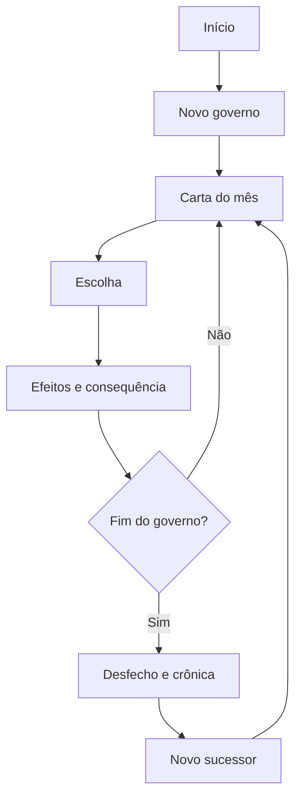

# DECRETUM: Salus Populi Suprema Lex

## Game Design Document — MVP v1.0

**Documento de referência para design, conteúdo e implementação**  
**Idioma do jogo:** português brasileiro  
**Plataforma inicial:** navegador desktop e mobile  
**Modelo:** single-player, sessões curtas, sem contas no MVP  
**Status:** especificação fechada para a primeira versão jogável  

> **Salus Populi Suprema Lex** — “O bem-estar do povo é a lei suprema.”

---

## 1. Resumo executivo

**DECRETUM** é um jogo de estratégia política em cartas no qual o jogador assume a presidência de uma república fictícia. A cada mês de governo, uma autoridade, grupo social ou instituição apresenta um dilema. O jogador toma uma de duas decisões possíveis, e cada escolha altera o equilíbrio entre quatro pilares de poder: **Povo, Mercado, Congresso e Instituições**.

O objetivo imediato é sobreviver aos 48 meses de um mandato. O objetivo real é governar sem permitir que qualquer pilar seja destruído ou se torne poderoso demais. Em DECRETUM, apoio absoluto também é uma ameaça: popularidade extrema pode virar culto de personalidade; um mercado dominante pode capturar o Estado; um Congresso onipotente pode tutelar o Executivo; e instituições hipertrofiadas podem paralisar o governo.

As decisões deixam marcas. Elas ativam flags, iniciam cadeias de acontecimentos, mudam cartas futuras e constroem a crônica do governo. Quando uma presidência termina, o jogador pode iniciar um governo sucessor que herda parte das consequências do anterior.

O MVP deve entregar uma experiência completa, curta e rejogável, com um motor orientado a dados, 30 cartas iniciais, oito desfechos de colapso, um desfecho de mandato concluído e estrutura para sucessão.

---

## 2. Visão do produto

### 2.1 High concept

Um jogo político de decisões binárias em que **governar não significa maximizar recursos, mas impedir que forças legítimas se convertam em forças absolutas**.

### 2.2 Fantasia do jogador

O jogador deve sentir que:

- ocupa a cadeira mais poderosa e mais vulnerável da República;
- decide sob pressão, com informação incompleta;
- precisa negociar com interesses incompatíveis;
- vê decisões antigas retornarem como consequências;
- escreve uma história política própria, não uma sequência aleatória de perguntas;
- pode sobreviver por habilidade, mas nunca controlar completamente o país.

### 2.3 Promessa central

**Toda escolha resolve uma urgência e cria um novo problema.**

### 2.4 Pilares de design

1. **Equilíbrio, não maximização**  
   Nenhum medidor deve ser simplesmente “quanto mais, melhor”. Os dois extremos são perigosos.

2. **Escolhas moral e politicamente ambíguas**  
   As opções devem representar prioridades diferentes. Evitar “certa versus errada”.

3. **Consequências legíveis, mas não totalmente previsíveis**  
   O jogador vê quais pilares tendem a mudar, porém descobre a magnitude exata depois de decidir.

4. **Memória política**  
   Flags e cadeias fazem o mundo reagir ao histórico do governo.

5. **Partidas curtas com histórias longas**  
   Um governo dura aproximadamente 10–20 minutos, mas sucessões e crônicas criam continuidade.

6. **Conteúdo separado do motor**  
   Cartas, condições, efeitos, desfechos e textos devem ser configuráveis por dados.

### 2.5 Diferenciação

DECRETUM utiliza o formato genérico de cartas e escolhas binárias, mas deve possuir identidade própria:

- equilíbrio bilateral dos quatro centros de poder;
- estrutura explícita de mandato presidencial de 48 meses;
- linguagem de decretos, atas, gabinetes e arquivo republicano;
- histórico político consultável;
- sucessão entre governos;
- país, personagens, instituições, símbolos e textos originais;
- foco em trade-offs institucionais, e não em sátira monárquica.

Não copiar nomes, textos, personagens, layouts, arte, sons, animações ou identidade de qualquer jogo existente.

---

## 3. Escopo

### 3.1 Incluído no MVP

- cargo de Presidente;
- país inteiramente fictício;
- quatro pilares;
- turnos mensais;
- mandato de 48 meses;
- escolhas esquerda/direita por botões e gesto horizontal;
- efeitos imediatos;
- flags permanentes e estrutura para flags temporárias;
- condições de elegibilidade;
- cooldown e pesos de cartas;
- cadeias simples de eventos;
- oito desfechos de colapso;
- conclusão de mandato;
- sucessor ligado ao governo anterior;
- crônica/histórico da partida;
- 30 cartas de conteúdo;
- interface responsiva e acessível;
- persistência no PostgreSQL;
- servidor autoritativo;
- testes determinísticos do motor.

### 3.2 Fora do MVP

- outros cargos políticos;
- políticos, partidos ou países reais;
- eleição, campanha e reeleição completas;
- criação de personagem;
- ideologia escolhida pelo jogador;
- contas, login ou ranking online;
- multiplayer;
- editor administrativo de cartas;
- geração de cartas por IA;
- áudio elaborado e dublagem;
- monetização;
- conquistas online;
- economia monetária detalhada;
- guerra tática;
- mapa geográfico interativo;
- aplicativos nativos.

### 3.3 Princípio de corte

Se uma funcionalidade não melhora diretamente **decidir, observar consequências, sobreviver ao mandato ou compreender a história criada**, ela não entra no MVP.

---

## 4. Mundo e tom

### 4.1 Cenário

O jogo se passa na **República de Aurória**, uma democracia presidencialista fictícia, urbana e industrializada, marcada por desigualdade regional, coalizões fragmentadas, imprensa ativa, Judiciário forte, forças armadas influentes e economia integrada ao exterior.

Aurória não representa diretamente nenhum país real. Os problemas devem ser reconhecíveis em diferentes democracias, sem reproduzir eventos ou figuras contemporâneas de forma identificável.

### 4.2 Instituições fictícias principais

- **Palácio Cívico:** sede da Presidência.
- **Assembleia Nacional:** parlamento bicameral abstraído como um único ator no MVP.
- **Tribunal da Carta:** corte constitucional.
- **Banco de Aurória:** autoridade monetária.
- **Conselho Federativo:** articulação dos governadores.
- **Agência Nacional de Integridade:** órgão de controle.
- **Forças de Defesa de Aurória:** comando militar.
- **União das Províncias:** pacto federativo do país.

### 4.3 Grupos recorrentes

- trabalhadores e sindicatos;
- empresários e investidores;
- líderes parlamentares;
- magistrados e órgãos de controle;
- imprensa;
- movimentos civis;
- governadores;
- forças de segurança;
- acadêmicos e especialistas;
- diplomatas e governos estrangeiros.

### 4.4 Tom narrativo

- sério, elegante e levemente irônico;
- tensão política sem cinismo absoluto;
- personagens defendem interesses plausíveis;
- humor surge da burocracia, das contradições e da vaidade do poder;
- nenhuma corrente política deve ser tratada como inerentemente correta ou caricatural;
- texto claro, curto e memorável;
- violência, corrupção e crise podem existir, mas sem gore ou choque gratuito.

### 4.5 Tema

A pergunta temática central é:

> **Quanto poder você aceita entregar para manter o governo funcionando?**

Temas secundários:

- legitimidade versus eficiência;
- curto prazo versus legado;
- ordem versus liberdade;
- crescimento versus proteção social;
- governabilidade versus independência;
- legalidade versus urgência;
- popularidade versus responsabilidade.

---

## 5. Público, plataforma e duração

### 5.1 Público-alvo

- jogadores de estratégia leve e narrativa interativa;
- pessoas interessadas em política, história, economia e dilemas públicos;
- público de 14 anos ou mais;
- jogadores casuais que preferem sessões curtas;
- jogadores analíticos interessados em dominar sistemas e descobrir cadeias.

### 5.2 Plataforma

- navegador moderno;
- layout mobile-first;
- desktop com mouse/teclado;
- mobile com toque e gesto;
- sem instalação obrigatória.

### 5.3 Duração pretendida

- primeira partida: 12–20 minutos;
- partidas posteriores: 8–15 minutos;
- leitura por carta: 10–25 segundos;
- retorno após uma derrota: menos de 15 segundos;

---

## 6. Estrutura da experiência

### 6.1 Fluxo macro



### 6.2 Core loop

1. Ver os quatro pilares e o mês atual.
2. Receber uma carta apresentada por um personagem ou grupo.
3. Ler o dilema e as duas opções.
4. Inspecionar a tendência dos efeitos.
5. Escolher esquerda ou direita.
6. Ver os efeitos aplicados e uma frase de consequência.
7. Registrar a decisão na crônica.
8. Verificar desfecho, mandato ou próximo mês.

### 6.3 Metaloop do MVP

1. Concluir ou perder um governo.
2. Ler o resumo daquela presidência.
3. Iniciar um sucessor.
4. Herdar flags marcadas como legado.
5. Descobrir variações de cartas e novas combinações.

---

## 7. Estado do jogo

Cada partida representa um governo e deve possuir, no mínimo:

| Campo | Tipo conceitual | Regra |
|---|---|---|
| `id` | UUID | Identificador do governo |
| `role` | enum | `president` no MVP |
| `status` | enum | `active`, `ended`, `completed` |
| `turn` | inteiro | Começa em 1 |
| `start_year` | inteiro | Ano fictício inicial |
| `people` | inteiro | 0–100 |
| `market` | inteiro | 0–100 |
| `congress` | inteiro | 0–100 |
| `institutions` | inteiro | 0–100 |
| `current_card_id` | UUID | Carta aguardando decisão |
| `last_card_id` | UUID/nulo | Evita repetição imediata |
| `previous_game_id` | UUID/nulo | Governo anterior |
| `mandate_completed` | booleano | Verdadeiro após o 48º mês sobrevivido |
| `ending_code` | string/nulo | Desfecho configurável |
| `rng_seed` | string/integer | Reprodutibilidade |
| timestamps | datas | Criação, atualização e fim |

### 7.1 Calendário

- 1 turno = 1 mês.
- O turno 1 corresponde a janeiro do ano 1.
- O turno 12 corresponde a dezembro do ano 1.
- O turno 13 corresponde a janeiro do ano 2.
- O turno 48 corresponde a dezembro do ano 4.
- O calendário exibido pode usar “Janeiro, Ano 1” no MVP, evitando associar a partida a datas reais.

Fórmulas:

```text
year = floor((turn - 1) / 12) + 1
monthIndex = (turn - 1) mod 12
```

### 7.2 Estado inicial

Todos os pilares começam em 50 no primeiro governo:

```json
{
  "people": 50,
  "market": 50,
  "congress": 50,
  "institutions": 50
}
```

Um sucessor utiliza valores de base 50 e modificadores de legado limitados. No MVP, o resultado inicial de qualquer pilar deve ser limitado ao intervalo **40–60**, para não criar derrota inevitável antes da primeira decisão.

---

## 8. Os quatro pilares

Os pilares representam **influência, dependência e pressão política**, não aprovação pura.

### 8.1 Povo (`people`)

Representa apoio popular, mobilização social e centralidade da opinião pública.

- baixo: deslegitimação, revolta, greve generalizada;
- alto: personalismo, plebiscitarismo e pressão das massas acima das regras.

### 8.2 Mercado (`market`)

Representa confiança econômica, investimento e influência do capital.

- baixo: recessão, desabastecimento, fuga de capitais;
- alto: captura regulatória e submissão do governo a interesses econômicos.

### 8.3 Congresso (`congress`)

Representa base parlamentar, capacidade legislativa e dependência da coalizão.

- baixo: isolamento e paralisia;
- alto: coalizão dominante, chantagem orçamentária e tutela parlamentar.

### 8.4 Instituições (`institutions`)

Representa confiança, autonomia e poder do Judiciário, órgãos de controle, burocracia e forças constitucionais.

- baixo: ruptura da ordem legal;
- alto: governo tutelado ou paralisado por instituições hipertrofiadas.

### 8.5 Faixas de leitura

| Valor | Estado | Apresentação |
|---:|---|---|
| 0 | colapso inferior | fim imediato |
| 1–14 | crítico inferior | alerta intenso |
| 15–29 | instável inferior | alerta moderado |
| 30–70 | zona governável | estado normal |
| 71–85 | instável superior | alerta moderado |
| 86–99 | crítico superior | alerta intenso |
| 100 | colapso superior | fim imediato |

### 8.6 Aplicação dos efeitos

Cada escolha contém deltas inteiros. O servidor aplica:

```text
novoValor = clamp(valorAtual + delta, 0, 100)
```

Depois de aplicar todos os deltas simultaneamente, o sistema avalia o fim do governo.

### 8.7 Intensidade dos efeitos

| Magnitude | Interpretação | Uso esperado |
|---:|---|---|
| 0 | sem efeito | comum em um pilar não envolvido |
| 1–3 | leve | ajuste frequente |
| 4–7 | relevante | padrão do MVP |
| 8–12 | forte | crise ou decisão estrutural |
| 13+ | excepcional | somente cartas raras e sinalizadas |

Regra de conteúdo: uma escolha comum deve alterar de dois a três pilares e ter magnitude absoluta total entre **8 e 18**. Efeitos maiores precisam de contexto, risco ou cadeia anterior.

---

## 9. Informação apresentada ao jogador

Antes de decidir, o jogador vê a **direção** do impacto, mas não os números exatos no modo padrão.

Exemplo:

```text
Aceitar o subsídio
Povo ↑↑ | Mercado ↓ | Congresso ↑
```

Legenda:

| Delta | Indicador |
|---:|---|
| 0 | nada |
| ±1 a ±3 | uma seta |
| ±4 a ±7 | duas setas |
| ±8 ou mais | três setas |

Após a escolha, os números exatos aparecem brevemente, por exemplo: `Povo +6`, `Mercado -4`.

Uma opção de acessibilidade chamada **“Efeitos exatos”** permite mostrar valores antes da decisão. Ela não altera regras ou pontuação.

Condições, flags futuras e chance de outras cartas não são reveladas diretamente. A escrita da consequência deve fornecer pistas narrativas.

---

## 10. Cartas

### 10.1 Anatomia visível

Uma carta exibe:

- retrato ou símbolo do interlocutor;
- nome;
- cargo/grupo;
- categoria opcional;
- texto do dilema;
- rótulo da escolha esquerda;
- rótulo da escolha direita;
- tendências de impacto da opção em foco.

### 10.2 Anatomia de dados

```json
{
  "slug": "teachers_strike",
  "role": "president",
  "speaker": {
    "name": "Mara Vilar",
    "title": "Ministra da Educação",
    "portraitKey": "education_minister"
  },
  "category": "education",
  "text": "Os professores ameaçam uma greve nacional. Podemos reajustar salários, mas o orçamento já está comprometido.",
  "leftChoice": {
    "label": "Conceder o reajuste",
    "effects": {
      "people": 7,
      "market": -4,
      "congress": -2,
      "institutions": 0
    },
    "setFlags": [
      { "key": "teachers_raise", "value": true, "legacy": false }
    ],
    "schedule": [],
    "resultText": "As aulas retornam, mas a equipe econômica exige compensações."
  },
  "rightChoice": {
    "label": "Manter o orçamento",
    "effects": {
      "people": -6,
      "market": 4,
      "congress": 2,
      "institutions": 0
    },
    "setFlags": [
      { "key": "teachers_strike_active", "value": true, "expiresAfterTurns": 8 }
    ],
    "schedule": [
      { "cardSlug": "strike_escalation", "delayTurns": 3 }
    ],
    "resultText": "Os sindicatos marcam o início da paralisação."
  },
  "conditions": {
    "allFlags": [],
    "anyFlags": [],
    "noneFlags": [],
    "minTurn": 1,
    "maxTurn": 48,
    "meters": {}
  },
  "weight": 10,
  "cooldownTurns": 12,
  "uniquePerGame": false,
  "active": true,
  "tags": ["education", "labor", "budget"]
}
```

### 10.3 Regras editoriais

- dilema: preferencialmente 120–260 caracteres;
- escolha: preferencialmente 2–6 palavras;
- consequência: preferencialmente 60–160 caracteres;
- usar voz ativa;
- explicar o conflito, não fazer palestra;
- cada opção deve ser defensável;
- evitar negação confusa, dupla negativa e rótulos vagos;
- não repetir o texto do botão na consequência;
- nomes e grupos fictícios;
- não depender de conhecimento jurídico ou econômico especializado.

### 10.4 Categorias do MVP

`economy`, `budget`, `health`, `education`, `infrastructure`, `security`, `labor`, `environment`, `foreign_affairs`, `federalism`, `justice`, `media`, `civil_rights`, `scandal`, `congress`.

### 10.5 Tipos de carta

1. **Comum:** entra no sorteio ponderado.
2. **Condicional:** exige flags, turno ou faixa de pilar.
3. **Encadeada:** é agendada como consequência de decisão anterior.
4. **Crise:** efeito alto e condição crítica; deve ser claramente sinalizada.
5. **Marco:** conclusão de mandato ou evento único.

---

## 11. Seleção da próxima carta

### 11.1 Ordem de prioridade

1. Carta agendada e vencida.
2. Carta de marco obrigatória.
3. Sorteio ponderado entre cartas elegíveis.

### 11.2 Elegibilidade

Uma carta comum só pode ser selecionada quando:

- está ativa;
- corresponde ao cargo atual;
- o turno está dentro de `minTurn` e `maxTurn`;
- todas as `allFlags` existem com valor compatível;
- pelo menos uma `anyFlags` existe, quando a lista não está vazia;
- nenhuma `noneFlags` proibida está ativa;
- condições de medidores são satisfeitas;
- não está em cooldown;
- não é a carta imediatamente anterior;
- não foi exibida, se `uniquePerGame = true`.

### 11.3 Sorteio ponderado

Para cada carta elegível `i`, com peso positivo `wᵢ`:

```text
P(i) = wᵢ / soma dos pesos elegíveis
```

O RNG deve ser injetável. Produção pode usar gerador pseudoaleatório com seed armazenada; testes devem fornecer uma sequência determinística.

### 11.4 Cooldown

Ao exibir uma carta no turno `t`, ela volta a ser elegível quando:

```text
turnoAtual >= t + cooldownTurns + 1
```

Exemplo: exibida no turno 5 com cooldown 3; pode retornar no turno 9.

### 11.5 Fallback

O seed do MVP deve garantir que sempre existam cartas neutras elegíveis. Ainda assim, se nenhuma carta for encontrada:

1. ignorar apenas cooldown, mantendo todas as demais condições;
2. manter a proibição de repetição imediata se houver mais de uma opção;
3. registrar warning estruturado;
4. nunca encerrar a partida silenciosamente.

### 11.6 Cartas agendadas

- uma decisão pode agendar uma carta para `turn_due`;
- cartas agendadas têm prioridade sobre sorteio;
- quando duas vencem no mesmo turno, usar `priority` decrescente e depois ordem de criação;
- se a condição da carta agendada deixar de ser válida, marcar como `cancelled` e seguir;
- uma carta agendada não deve aparecer no mesmo turno da decisão que a criou;
- no MVP, cada decisão agenda no máximo uma continuação.

---

## 12. Decisões e resolução de turno

### 12.1 Entrada aceita

O cliente envia somente:

```json
{ "choice": "left" }
```

ou:

```json
{ "choice": "right" }
```

IDs de efeitos, deltas e flags nunca são aceitos do cliente.

### 12.2 Ordem atômica

Dentro de uma transação:

1. bloquear o registro da partida;
2. confirmar que o jogo está ativo;
3. confirmar que a carta é a carta atual;
4. confirmar que não existe decisão para aquele turno;
5. carregar a opção no servidor;
6. calcular e aplicar deltas simultaneamente;
7. gravar a decisão e snapshot antes/depois;
8. aplicar, remover ou expirar flags;
9. criar eventos agendados;
10. avaliar os oito extremos;
11. se não houver colapso, avaliar o 48º turno;
12. avançar o turno e selecionar a próxima carta, quando aplicável;
13. atualizar a partida;
14. concluir a transação.

### 12.3 Empate entre desfechos

Uma única decisão pode levar mais de um pilar a um extremo. Para garantir determinismo, o desfecho principal será o pilar com maior **excesso normalizado**:

```text
se valor <= 0: excesso = abs(valorBrutoAntesDoClamp)
se valor >= 100: excesso = valorBrutoAntesDoClamp - 100
```

Se persistir empate, usar esta precedência fixa:

1. Instituições
2. Povo
3. Congresso
4. Mercado

Os outros colapsos devem aparecer no resumo como crises simultâneas, sem alterar o ending principal.

### 12.4 Idempotência e concorrência

- deve existir uma restrição única por `(game_id, turn)` na tabela de decisões;
- duas requisições concorrentes não podem avançar dois meses;
- a segunda deve receber conflito HTTP 409;
- o estado retornado sempre vem do servidor após commit.

---

## 13. Flags e condições

### 13.1 Tipos de flag

| Tipo | Duração | Exemplo |
|---|---|---|
| permanente do governo | até o fim | `tax_reform_approved` |
| temporária | até `expires_at_turn` | `teachers_strike_active` |
| legado | pode passar ao sucessor | `sovereign_debt_crisis` |

### 13.2 Operações permitidas no MVP

- definir valor booleano;
- definir valor string ou número simples;
- sobrescrever valor existente;
- remover flag;
- expirar no início de um turno;
- marcar como herdável.

Não criar linguagem de scripts ou expressões arbitrárias dentro do conteúdo.

### 13.3 Semântica de expiração

Uma flag com `expires_at_turn = 10` permanece ativa durante a resolução do turno 9 e é expirada **antes da seleção da carta do turno 10**.

### 13.4 Condições de medidor

Formato conceitual:

```json
{
  "people": { "min": 0, "max": 25 },
  "market": { "min": 40, "max": 100 }
}
```

Limites são inclusivos. Campos ausentes não restringem.

---

## 14. Fim do governo

O governo termina imediatamente quando qualquer pilar alcança 0 ou 100 após uma decisão.

### 14.1 Oito desfechos de colapso

| Código | Condição | Título | Premissa narrativa |
|---|---|---|---|
| `people_abandoned` | Povo ≤ 0 | **As Praças Vazias** | Sem legitimidade, greves e protestos tornam o governo inviável. |
| `people_dominant` | Povo ≥ 100 | **A Voz Única** | A devoção popular dissolve contrapesos e converte a Presidência em culto pessoal. |
| `market_collapsed` | Mercado ≤ 0 | **O Dia Sem Crédito** | Empresas fecham, capitais fogem e o abastecimento entra em colapso. |
| `market_dominant` | Mercado ≥ 100 | **A República dos Contratos** | Consórcios econômicos passam a ditar a agenda do Estado. |
| `congress_isolated` | Congresso ≤ 0 | **O Governo Sem Maioria** | A Assembleia bloqueia o Executivo e o gabinete cai. |
| `congress_dominant` | Congresso ≥ 100 | **A Presidência de Cerimônia** | A coalizão controla orçamento, ministros e decretos. |
| `institutions_broken` | Instituições ≤ 0 | **A Carta Rasgada** | A ordem constitucional perde autoridade e o governo é derrubado. |
| `institutions_dominant` | Instituições ≥ 100 | **O Governo Tutelado** | Cortes, controles e burocracias imobilizam o Executivo. |

### 14.2 Mandato concluído

Se o jogador resolver com sucesso a decisão do turno 48 sem atingir um extremo:

- `status = completed`;
- `mandate_completed = true`;
- mostrar a carta especial **“Quatro Anos Depois”**;
- não selecionar carta normal seguinte;
- mostrar resumo e opção de iniciar sucessor.

Texto-base:

> Quarenta e oito meses, centenas de concessões e uma República ainda de pé. O poder será transmitido, mas as consequências permanecerão.

### 14.3 Tela de desfecho

Exibir:

- título e texto do ending;
- causa principal;
- crises simultâneas, se existirem;
- duração em meses e anos;
- valores finais dos quatro pilares;
- quantidade de decisões;
- três decisões de maior impacto;
- flags de legado geradas;
- botão “Ler a crônica”;
- botão “Iniciar governo sucessor”.

---

## 15. Pontuação e avaliação

Pontuação serve para comparação pessoal e feedback, não ranking online.

### 15.1 Componentes

```text
survivalScore = mesesSobrevividos × 100
completionBonus = 2500 se concluiu o mandato, senão 0
balanceBonus = round(médiaDaEstabilidade × 20)
```

Para cada snapshot mensal:

```text
estabilidadeDoPilar = 1 - abs(valor - 50) / 50
estabilidadeDoMês = média das quatro estabilidades × 100
```

Pontuação final:

```text
score = survivalScore + completionBonus + balanceBonus
```

Faixa teórica aproximada do primeiro mandato: 100 a 9300 pontos.

### 15.2 Título de governo

O jogo escolhe um epíteto com base no histórico. No MVP, implementar ao menos:

- **O Equilibrista:** concluiu mandato e estabilidade média ≥ 75.
- **A Voz das Ruas:** Povo foi o pilar médio mais alto.
- **O Fiador da Economia:** Mercado foi o pilar médio mais alto.
- **O Mestre da Coalizão:** Congresso foi o pilar médio mais alto.
- **O Guardião da Carta:** Instituições foi o pilar médio mais alto.
- **O Sobrevivente:** chegou ao mês 36 sem concluir.
- **O Governo Breve:** terminou antes do mês 12.

O epíteto é narrativo e não modifica mecânicas.

---

## 16. Sucessão e legado

### 16.1 Fluxo

Após qualquer final, o jogador pode iniciar um novo governo ligado ao anterior por `previous_game_id`.

### 16.2 Herança no MVP

Somente flags marcadas com `legacy = true` são copiadas. Cada flag pode declarar modificadores iniciais:

```json
{
  "key": "sovereign_debt_crisis",
  "legacy": true,
  "successorEffects": {
    "people": -2,
    "market": -8,
    "congress": 2,
    "institutions": 0
  }
}
```

Somar todos os modificadores herdados e limitar cada pilar a 40–60.

### 16.3 Limites

- no máximo cinco flags herdadas por sucessão no MVP;
- prioridade: flags com `legacyPriority` maior;
- flags não selecionadas permanecem na crônica, mas não afetam o próximo jogo;
- a sucessão não é reeleição; é um novo governo no mesmo mundo;
- nenhuma árvore genealógica, partido ou candidato precisa ser simulado.

### 16.4 Legados previstos nas 30 cartas

- `tax_reform_approved`;
- `sovereign_debt_crisis`;
- `international_green_treaty`;
- `constitutional_precedent`;
- `national_data_registry`;
- `strategic_port_concession`.

---

## 17. Personagens recorrentes

| Personagem | Papel | Motivação | Voz |
|---|---|---|---|
| Helena Arcos | Chefe da Casa Civil | manter o governo funcional | precisa, pragmática |
| Caio Ferraz | Ministro da Fazenda | preservar solvência e confiança | técnico, direto |
| Mara Vilar | Ministra da Educação | ampliar acesso e estrutura | firme, idealista |
| Dr. Ícaro Nunes | Ministro da Saúde | proteger capacidade do sistema | urgente, clínico |
| Raul Serpa | Líder da coalizão | transformar apoio em influência | cordial, calculista |
| Lívia Ornelas | Presidente do Tribunal da Carta | defender procedimentos e precedentes | sóbria, formal |
| Nina Vale | Jornalista do Correio Cívico | obter informação e responsabilizar o poder | incisiva |
| Tomás Gade | Presidente da Federação Industrial | previsibilidade e competitividade | polido, insistente |
| Joana Reis | Líder da Central dos Trabalhadores | renda, emprego e proteção social | combativa |
| General Otávio Leme | Chefe das Forças de Defesa | ordem, capacidade operacional e prestígio | lacônico |
| Yuri Salcedo | Governador do Norte | recursos e autonomia regional | carismático, pressionador |
| Amira Sol | Chanceler | proteger alianças e reputação externa | diplomática |

Retratos devem ser originais e consistentes. Diversidade de idade, gênero e origem regional deve existir sem transformar personagens em tokens ou estereótipos.

---

## 18. Conteúdo inicial — 30 cartas

Os números abaixo são o baseline do primeiro balanceamento. Todos os efeitos usam a ordem **Povo / Mercado / Congresso / Instituições**.

### 18.1 Cartas comuns (1–20)

#### 1. O Orçamento de Emergência — `emergency_budget`

- **Falante:** Caio Ferraz, Fazenda
- **Dilema:** A arrecadação caiu. A Fazenda propõe congelar gastos, enquanto governadores exigem a manutenção dos repasses.
- **Esquerda — Congelar gastos:** `-5 / +7 / -3 / +2`
- **Direita — Manter repasses:** `+5 / -6 / +4 / -1`
- **Resultado esquerda:** O mercado respira; hospitais regionais anunciam cortes.
- **Resultado direita:** Governadores celebram, e a dívida ocupa as manchetes.
- **Peso/cooldown:** 10 / 10
- **Tags:** budget, federalism

#### 2. Greve dos Professores — `teachers_strike`

- **Falante:** Mara Vilar, Educação
- **Dilema:** Professores ameaçam parar as escolas. O reajuste encerra a crise, mas rompe o limite orçamentário.
- **Esquerda — Conceder reajuste:** `+7 / -4 / -2 / 0`; flag `teachers_raise`
- **Direita — Manter orçamento:** `-6 / +4 / +2 / 0`; flag temporária `teachers_strike_active`; agenda carta 21 em 3 turnos
- **Peso/cooldown:** 9 / 14
- **Tags:** education, labor

#### 3. Concessão do Porto Real — `strategic_port_concession`

- **Falante:** Tomás Gade, Federação Industrial
- **Dilema:** Um consórcio oferece modernizar o maior porto do país em troca de uma concessão de trinta anos.
- **Esquerda — Assinar concessão:** `-3 / +8 / +2 / -4`; flag legada `strategic_port_concession`
- **Direita — Manter controle estatal:** `+3 / -6 / -1 / +4`
- **Peso/cooldown:** 8 / 18; única
- **Tags:** infrastructure, economy

#### 4. Filas nos Hospitais — `hospital_queues`

- **Falante:** Dr. Ícaro Nunes, Saúde
- **Dilema:** As filas dobraram. Podemos contratar uma rede privada ou abrir crédito extraordinário para hospitais públicos.
- **Esquerda — Contratar a rede:** `-2 / +5 / +3 / -3`
- **Direita — Abrir crédito público:** `+6 / -5 / -2 / +2`
- **Peso/cooldown:** 10 / 10
- **Tags:** health, budget

#### 5. A Emenda da Coalizão — `coalition_amendment`

- **Falante:** Raul Serpa, líder da coalizão
- **Dilema:** A coalizão garante aprovar sua agenda se puder indicar a direção das agências reguladoras.
- **Esquerda — Aceitar indicações:** `-2 / +2 / +8 / -6`; flag `agencies_shared`
- **Direita — Preservar autonomia:** `+1 / -1 / -7 / +6`
- **Peso/cooldown:** 10 / 12
- **Tags:** congress, justice

#### 6. Sigilo no Palácio — `palace_secrecy`

- **Falante:** Nina Vale, Correio Cívico
- **Dilema:** A imprensa exige as agendas de ministros após reuniões não registradas com empresários.
- **Esquerda — Publicar agendas:** `+4 / -3 / -2 / +6`; flag `transparent_agendas`
- **Direita — Manter sigilo:** `-5 / +3 / +3 / -6`; flag `palace_secrecy_kept`
- **Peso/cooldown:** 8 / 16; única
- **Tags:** media, scandal

#### 7. Marcha pela Segurança — `security_march`

- **Falante:** General Otávio Leme, Defesa
- **Dilema:** Após uma onda de violência, manifestantes pedem patrulhamento militar temporário nas grandes cidades.
- **Esquerda — Autorizar patrulhas:** `+4 / +1 / +2 / -7`; flag temporária `military_patrols`, 8 turnos
- **Direita — Reforçar polícia civil:** `-2 / -3 / -1 / +6`
- **Peso/cooldown:** 9 / 12
- **Tags:** security, civil_rights

#### 8. A Floresta Mineral — `forest_mining`

- **Falante:** Yuri Salcedo, governador
- **Dilema:** Uma reserva mineral promete empregos no Norte, mas parte dela está sob proteção ambiental.
- **Esquerda — Liberar exploração:** `+2 / +8 / +4 / -6`; flag `forest_mining_allowed`
- **Direita — Preservar reserva:** `+3 / -7 / -3 / +5`; flag `forest_preserved`
- **Peso/cooldown:** 8 / 18; única
- **Tags:** environment, economy, federalism

#### 9. Imposto sobre Grandes Heranças — `inheritance_tax`

- **Falante:** Helena Arcos, Casa Civil
- **Dilema:** A equipe social propõe elevar o imposto sobre grandes heranças para financiar creches nacionais.
- **Esquerda — Enviar o projeto:** `+7 / -7 / -3 / +1`; flag `inheritance_tax_bill`
- **Direita — Arquivar proposta:** `-5 / +6 / +3 / -1`
- **Peso/cooldown:** 9 / 14
- **Tags:** economy, congress

#### 10. Juros sob Pressão — `interest_rate_pressure`

- **Falante:** Caio Ferraz, Fazenda
- **Dilema:** O Banco de Aurória elevou os juros. Seus aliados pedem que o governo pressione publicamente pela reversão.
- **Esquerda — Criticar o Banco:** `+5 / -5 / +3 / -7`; flag `central_bank_pressured`
- **Direita — Respeitar autonomia:** `-3 / +6 / -2 / +7`
- **Peso/cooldown:** 9 / 12
- **Tags:** economy, institutions

#### 11. Salário Mínimo — `minimum_wage`

- **Falante:** Joana Reis, trabalhadores
- **Dilema:** A Central pede aumento real do salário mínimo. Pequenas empresas alertam que demissões podem seguir.
- **Esquerda — Aprovar aumento:** `+8 / -6 / +2 / 0`
- **Direita — Corrigir só a inflação:** `-6 / +6 / -1 / 0`
- **Peso/cooldown:** 10 / 10
- **Tags:** labor, economy

#### 12. Obras Antes das Chuvas — `flood_infrastructure`

- **Falante:** Yuri Salcedo, governador
- **Dilema:** Governadores pedem liberação imediata de verbas contra enchentes, sem o processo completo de licitação.
- **Esquerda — Liberar em emergência:** `+6 / -2 / +4 / -7`; flag `emergency_procurement`
- **Direita — Exigir licitação:** `-4 / -1 / -3 / +7`
- **Peso/cooldown:** 10 / 10
- **Tags:** infrastructure, institutions

#### 13. Dados para Todos — `national_data_registry`

- **Falante:** Lívia Ornelas, Tribunal da Carta
- **Dilema:** Um cadastro nacional unificado reduziria fraudes, mas concentraria dados sensíveis de toda a população.
- **Esquerda — Criar cadastro:** `+2 / +5 / +3 / -8`; flag legada `national_data_registry`
- **Direita — Manter bases separadas:** `-2 / -4 / -1 / +7`
- **Peso/cooldown:** 7 / 20; única
- **Tags:** civil_rights, institutions

#### 14. Tarifas de Importação — `import_tariffs`

- **Falante:** Tomás Gade, Federação Industrial
- **Dilema:** A indústria pede tarifas contra produtos estrangeiros. Consumidores temem preços mais altos.
- **Esquerda — Elevar tarifas:** `+2 / +5 / +4 / -1`; flag `protectionist_tariffs`
- **Direita — Manter abertura:** `-4 / +4 / -2 / +1`
- **Peso/cooldown:** 9 / 12
- **Tags:** economy, foreign_affairs

#### 15. Refugiados na Fronteira — `border_refugees`

- **Falante:** Amira Sol, Chanceler
- **Dilema:** Uma crise no país vizinho leva milhares de refugiados à fronteira. As províncias pedem uma decisão imediata.
- **Esquerda — Abrir acolhimento:** `+3 / -4 / -4 / +6`; flag `refugees_welcomed`
- **Direita — Restringir entrada:** `+1 / +3 / +5 / -6`; flag `border_restricted`
- **Peso/cooldown:** 7 / 18; única
- **Tags:** foreign_affairs, civil_rights

#### 16. Perdão das Dívidas Rurais — `rural_debt_relief`

- **Falante:** Raul Serpa, coalizão
- **Dilema:** A bancada rural condiciona votos ao perdão parcial das dívidas de produtores atingidos pela seca.
- **Esquerda — Conceder perdão:** `+3 / -4 / +8 / -3`
- **Direita — Oferecer só crédito:** `-2 / +4 / -6 / +2`
- **Peso/cooldown:** 9 / 12
- **Tags:** congress, economy

#### 17. Câmeras nas Fardas — `police_body_cameras`

- **Falante:** Joana Reis, trabalhadores
- **Dilema:** Organizações civis pedem câmeras corporais obrigatórias. Comandos policiais ameaçam reduzir operações.
- **Esquerda — Tornar obrigatórias:** `+5 / -1 / -3 / +7`; flag `body_cameras_required`
- **Direita — Programa voluntário:** `-4 / +1 / +4 / -4`
- **Peso/cooldown:** 8 / 16; única
- **Tags:** security, civil_rights

#### 18. A Ponte Inacabada — `unfinished_bridge`

- **Falante:** Helena Arcos, Casa Civil
- **Dilema:** A maior obra do governo está atrasada. Trocar a empreiteira encarece o projeto; mantê-la preserva o prazo político.
- **Esquerda — Trocar empreiteira:** `+2 / -5 / -3 / +6`
- **Direita — Manter contrato:** `-4 / +5 / +3 / -5`; flag `questioned_contractor`
- **Peso/cooldown:** 9 / 14
- **Tags:** infrastructure, scandal

#### 19. Transmissão Presidencial — `presidential_broadcast`

- **Falante:** Helena Arcos, Casa Civil
- **Dilema:** Sua equipe propõe transmissões semanais sem entrevistas para falar diretamente com a população.
- **Esquerda — Falar toda semana:** `+7 / -1 / -3 / -6`; flag `direct_broadcasts`
- **Direita — Manter coletivas:** `-2 / 0 / +2 / +5`
- **Peso/cooldown:** 8 / 16
- **Tags:** media, institutions

#### 20. Reforma Tributária — `tax_reform`

- **Falante:** Caio Ferraz, Fazenda
- **Dilema:** Um novo imposto unificado simplifica o sistema, mas retira benefícios de setores e províncias influentes.
- **Esquerda — Unificar impostos:** `+2 / +8 / -7 / +5`; flag legada `tax_reform_approved`; agenda carta 23 em 5 turnos
- **Direita — Preservar o sistema:** `-2 / -5 / +6 / -2`
- **Peso/cooldown:** 6 / 30; única; turno mínimo 8
- **Tags:** economy, congress, federalism

### 18.2 Cartas condicionais e cadeias (21–27)

#### 21. A Greve se Espalha — `strike_escalation`

- **Condição:** flag `teachers_strike_active`; agendada pela carta 2
- **Falante:** Mara Vilar
- **Dilema:** A greve fechou quase todas as escolas. Prefeitos exigem mediação; a Fazenda insiste em não ceder.
- **Esquerda — Reabrir negociação:** `+6 / -5 / +2 / +1`; remove `teachers_strike_active`
- **Direita — Cortar os dias parados:** `-9 / +4 / +4 / -5`; flag `strike_repressed`
- **Única**

#### 22. Contratos sob Suspeita — `contract_investigation`

- **Condição:** qualquer flag `questioned_contractor` ou `emergency_procurement`
- **Falante:** Lívia Ornelas
- **Dilema:** Auditores encontraram pagamentos incomuns. Suspender contratos interrompe obras; mantê-los preserva entregas.
- **Esquerda — Suspender e investigar:** `+3 / -5 / -4 / +9`; flag `constitutional_precedent` legada
- **Direita — Manter as obras:** `-6 / +5 / +4 / -8`; flag `audit_ignored`
- **Peso/cooldown:** 14 / 30; única

#### 23. A Conta da Reforma — `tax_reform_backlash`

- **Condição:** `tax_reform_approved`; agendada pela carta 20
- **Falante:** Yuri Salcedo
- **Dilema:** Províncias perderam receita durante a transição tributária. Elas pedem compensação federal por dois anos.
- **Esquerda — Criar compensação:** `+4 / -5 / +7 / +1`; flag `transition_fund`
- **Direita — Cobrar adaptação:** `-5 / +5 / -7 / +2`
- **Única**

#### 24. O Dossiê Vazado — `leaked_dossier`

- **Condição:** qualquer `palace_secrecy_kept`, `agencies_shared` ou `audit_ignored`
- **Falante:** Nina Vale
- **Dilema:** Documentos vazados ligam seu gabinete a decisões reservadas. O país espera uma resposta até o fim do dia.
- **Esquerda — Demitir envolvidos:** `+5 / -3 / -6 / +8`; remove uma flag causadora
- **Direita — Atacar o vazamento:** `-8 / +2 / +5 / -8`; flag `press_intimidated`
- **Peso/cooldown:** 13 / 30; única; turno mínimo 6

#### 25. A Seca e os Reservatórios — `drought_crisis`

- **Condição:** turno mínimo 12; Instituições entre 10 e 90
- **Falante:** Dr. Ícaro Nunes
- **Dilema:** A seca ameaça energia e abastecimento. Racionar agora reduz o risco futuro, mas atinge famílias e fábricas.
- **Esquerda — Iniciar racionamento:** `-5 / -5 / +1 / +7`; flag temporária `rationing`, 6 turnos
- **Direita — Adiar restrições:** `+4 / +4 / +1 / -6`; flag `reservoir_risk`; agenda carta 26 em 4 turnos
- **Peso/cooldown:** 6 / 30; única

#### 26. As Luzes se Apagam — `blackout`

- **Condição:** `reservoir_risk`; agendada pela carta 25
- **Falante:** Helena Arcos
- **Dilema:** Apagões atingem três províncias. É possível intervir nas distribuidoras ou subsidiar geradores privados.
- **Esquerda — Intervir nas empresas:** `+2 / -9 / -2 / +5`; flag `energy_intervention`
- **Direita — Subsidiar geradores:** `-3 / +7 / +4 / -4`
- **Única**

#### 27. Tratado das Águas — `green_treaty`

- **Condição:** turno mínimo 18
- **Falante:** Amira Sol
- **Dilema:** Países vizinhos propõem metas ambientais comuns. O tratado abre crédito externo, mas limita novos projetos minerais.
- **Esquerda — Assinar tratado:** `+4 / -4 / -3 / +7`; flag legada `international_green_treaty`
- **Direita — Recusar limites:** `-3 / +7 / +4 / -6`
- **Peso/cooldown:** 5 / 30; única

### 18.3 Cartas de estado crítico (28–30)

Essas cartas ajudam o jogador a reagir, mas não garantem salvação. Só entram quando o pilar indicado está entre 1–18 ou 82–99.

#### 28. Gabinete de Reconciliação — `reconciliation_cabinet`

- **Condição:** Congresso crítico em qualquer extremo; única
- **Falante:** Helena Arcos
- **Dilema:** O gabinete propõe uma reforma ministerial para reduzir a tensão com a Assembleia, mas todos cobrarão espaço.
- **Esquerda — Dividir o gabinete:** `-2 / 0 / +10 se baixo, -10 se alto / -3`
- **Direita — Governar sem reforma:** `+2 / +1 / -4 se baixo, +4 se alto / +3`
- **Nota técnica:** efeitos direcionais condicionais devem ser representados por operação de aproximação/afastamento, não por código específico do slug.

#### 29. Pacto de Estabilidade — `stability_pact`

- **Condição:** Mercado crítico em qualquer extremo; única
- **Falante:** Caio Ferraz
- **Dilema:** Fazenda, sindicatos e empresas aceitam um pacto temporário. Para funcionar, você deve congelar parte da própria agenda.
- **Esquerda — Assinar o pacto:** `-3 / +10 se baixo, -10 se alto / +2 / +3`
- **Direita — Manter liberdade:** `+3 / -4 se baixo, +4 se alto / -1 / -2`

#### 30. Pronunciamento à República — `address_to_republic`

- **Condição:** Povo ou Instituições em estado crítico; única
- **Falante:** Helena Arcos
- **Dilema:** O país aguarda um pronunciamento. Você pode admitir erros e limitar seus poderes, ou convocar apoio contra seus adversários.
- **Esquerda — Admitir e limitar:** `+10 se Povo baixo, -10 se alto / -2 / -2 / +8 se Instituições baixas, -8 se altas`
- **Direita — Convocar as ruas:** `+8 se Povo baixo, +4 se alto / -1 / +2 / -8 se Instituições baixas, +4 se altas`
- **Nota de balanceamento:** revisar esta carta com testes simulados; ela deve oferecer recuperação, não eliminar o risco.

### 18.4 Operações condicionais de efeito

As cartas 28–30 exigem um operador genérico, permitido no motor:

```json
{
  "type": "toward_center",
  "meter": "congress",
  "amount": 10
}
```

Regras:

- `toward_center`: se valor < 50, soma; se valor > 50, subtrai;
- `away_from_center`: se valor < 50, subtrai; se valor > 50, soma;
- se valor = 50, efeito 0;
- efeitos fixos continuam usando deltas comuns;
- não aceitar funções, JavaScript ou fórmulas arbitrárias no banco.

---

## 19. Balanceamento

### 19.1 Metas iniciais

Após testes com jogadores que conhecem as regras:

- 25–40% devem concluir o primeiro mandato;
- mediana de sobrevivência: 28–38 turnos;
- menos de 10% das derrotas devem ocorrer antes do turno 8;
- todos os oito endings devem ser alcançáveis;
- nenhuma escolha deve dominar sua alternativa em mais de 65% das situações simuladas;
- nenhuma carta comum deve aparecer mais de quatro vezes no mesmo governo.

Essas metas orientam o ajuste; não são garantias matemáticas do MVP.

### 19.2 Heurísticas

- efeitos positivos e negativos devem se distribuir entre todos os pilares;
- não colocar muitas cartas consecutivas com o mesmo par de pilares;
- decisões de recuperação devem cobrar custo em outro eixo;
- extremos altos e baixos precisam ser igualmente possíveis;
- evitar que a zona central seja estável demais e produza partidas automáticas;
- cartas de crise devem resultar do estado ou de escolhas anteriores, não apenas azar puro.

### 19.3 Telemetria local de teste

Mesmo sem analytics externo, criar script de simulação capaz de executar milhares de partidas com políticas simples:

- escolha aleatória;
- escolha que maximiza proximidade do centro;
- escolha que favorece cada pilar;
- escolha alternada.

Relatório mínimo:

- duração média e mediana;
- taxa de conclusão;
- distribuição de endings;
- frequência de cartas;
- decisões por opção;
- pilares médios por turno;
- situações sem carta elegível.

O simulador é ferramenta de desenvolvimento e não precisa aparecer na interface.

---

## 20. UX e interface

### 20.1 Tela principal

Ordem vertical em mobile:

1. cabeçalho com `DECRETUM` e mês/ano;
2. quatro pilares em uma linha ou grade 2×2;
3. carta central;
4. consequência temporária, quando aplicável;
5. escolhas esquerda/direita;
6. acesso à crônica e configurações.

No desktop, manter a carta como foco central e não transformar a tela em dashboard.

### 20.2 Interação

- arrastar a carta para a esquerda pré-visualiza a escolha esquerda;
- arrastar para a direita pré-visualiza a escolha direita;
- soltar além do limiar confirma;
- soltar antes do limiar retorna a carta ao centro;
- botões sempre disponíveis como fallback;
- teclado: seta esquerda/direita muda foco; Enter confirma; Escape cancela prévia;
- bloquear nova interação enquanto a decisão está sendo processada;
- em falha de rede, restaurar a carta e permitir tentar novamente sem duplicar turno.

### 20.3 Feedback

Ao confirmar:

1. carta sai em 150–250 ms;
2. deltas exatos aparecem nos medidores;
3. medidores animam para o novo valor em 250–450 ms;
4. frase de consequência aparece por tempo suficiente para leitura;
5. próxima carta entra.

Respeitar `prefers-reduced-motion`: substituir deslocamentos por fades simples ou atualização instantânea.

### 20.4 Alertas dos pilares

- zona governável: ícone estável;
- instável: pulsação discreta e rótulo textual;
- crítico: borda forte, aviso e padrão visual;
- não depender apenas de cor.

Não revelar antecipadamente “esta decisão causa game over”. A tendência e o medidor atual fornecem informação suficiente.

### 20.5 Crônica

Lista cronológica contendo:

- mês e ano;
- falante e dilema resumido;
- escolha tomada;
- deltas;
- consequência;
- flags públicas relevantes, traduzidas para linguagem narrativa.

A crônica pode ser aberta sem abandonar a partida.

### 20.6 Telas do MVP

- capa/início;
- tutorial curto;
- jogo;
- crônica;
- pausa/configurações;
- desfecho;
- confirmação de sucessão;
- erro recuperável/estado não encontrado.

---

## 21. Direção de arte

### 21.1 Conceito visual

**Arquivo constitucional contemporâneo:** documentos, selos, tinta, metal e interfaces editoriais combinados a uma república moderna.

### 21.2 Paleta sugerida

- azul-noite: autoridade e fundo;
- marfim/papel: áreas de leitura;
- cobre envelhecido: detalhes e progresso;
- vermelho cívico: risco e urgência;
- verde profundo: confirmação, usado com moderação.

### 21.3 Tipografia

- títulos: serifada editorial ou lapidária, com boa legibilidade;
- interface e corpo: sans-serif neutra;
- números dos pilares: tabulares;
- no máximo duas famílias tipográficas.

### 21.4 Cartas e retratos

- moldura inspirada em fichas de arquivo e documentos oficiais;
- retratos em meio-corpo ou busto, fundo simples;
- símbolos geométricos próprios para os quatro pilares;
- evitar estética medieval, coroa, trono ou pergaminho fantasioso;
- evitar aparência de aplicativo bancário ou dashboard corporativo.

### 21.5 Logo

`DECRETUM` em caixa alta; subtítulo `Salus Populi Suprema Lex`. Um selo abstrato pode combinar quatro arcos em tensão ao redor de um centro vazio. Nenhum símbolo nacional real.

---

## 22. Áudio

Áudio não é obrigatório para o primeiro corte funcional. Se incluído:

- ambiente discreto de gabinete, chuva, papel e cidade distante;
- som curto de papel ao apresentar carta;
- impactos sutis diferentes para aumento e queda;
- batida grave em zona crítica;
- tema final breve;
- controles independentes e mute persistente.

Evitar vozes no MVP e não reproduzir sons reconhecíveis de outros jogos.

---

## 23. Tutorial

Tutorial contextual de no máximo quatro passos:

1. **“Você governa por decisões mensais.”** Destacar a carta.
2. **“Escolha um caminho.”** Mostrar gesto e botões.
3. **“Toda decisão altera forças políticas.”** Destacar pilares e tendências.
4. **“Zero destrói uma força; cem permite que ela domine.”** Explicar os dois extremos.

A primeira partida começa com uma carta de efeito moderado. O tutorial não deve garantir vitória nem utilizar uma partida separada.

Pode ser pulado e reaberto nas configurações.

---

## 24. Acessibilidade

Requisitos mínimos:

- navegação completa por teclado;
- foco visível;
- botões com nomes acessíveis;
- textos e ícones para estados, nunca apenas cor;
- contraste WCAG AA;
- suporte a zoom de 200%;
- alvos de toque adequados;
- opção de reduzir movimento;
- opção de mostrar números exatos;
- sem tempo limite para decidir;
- linguagem direta;
- atualizações de pilares anunciadas por região `aria-live` sem excesso de interrupções.

---

## 25. Persistência e retorno

- a partida é persistida após toda decisão confirmada;
- recarregar a página retorna à carta atual;
- uma carta não decidida não muda por refresh;
- o estado local pode guardar somente preferências e o ID da partida;
- o banco é a fonte de verdade;
- não permitir selecionar novamente uma opção já resolvida;
- se o ID local não existir, oferecer novo governo sem erro técnico exposto.

---

## 26. Modelo de dados conceitual

### 26.1 Entidades

| Entidade | Responsabilidade |
|---|---|
| `games` | estado corrente e relação de sucessão |
| `cards` | conteúdo e metadados das cartas |
| `card_choices` | opções e efeitos, se normalizado |
| `decisions` | histórico imutável dos turnos |
| `game_flags` | estado de flags por governo |
| `scheduled_events` | cartas encadeadas futuras |
| `card_appearances` | cooldown, frequência e última exibição |
| `endings` | textos configuráveis de desfecho |

O implementador pode armazenar escolhas/condições em JSONB ou normalizá-las parcialmente. A decisão deve privilegiar validação, consultas simples e evolução do conteúdo, sem criar um CMS genérico.

### 26.2 Snapshot da decisão

Cada decisão deve registrar:

- `game_id`;
- `turn`;
- `card_id` e versão lógica do conteúdo;
- `choice`;
- texto/label escolhido no momento;
- efeitos resolvidos;
- pilares antes e depois;
- flags alteradas;
- eventos agendados;
- timestamp.

O histórico não deve mudar quando uma carta for editada futuramente.

---

## 27. Contrato de API funcional

Base: `/api/v1`

### 27.1 Health

`GET /health`

Retorna disponibilidade do serviço e, opcionalmente, conexão com banco sem expor detalhes sensíveis.

### 27.2 Criar governo

`POST /games`

Cria partida, valores iniciais e primeira carta.

### 27.3 Consultar governo

`GET /games/:id`

Retorna estado, carta atual e preferencialmente resumo da crônica paginável/separado se o payload crescer.

### 27.4 Tomar decisão

`POST /games/:id/decisions`

Request:

```json
{ "choice": "left" }
```

Response de continuidade:

```json
{
  "decision": {},
  "effects": {},
  "resultText": "...",
  "game": {},
  "nextCard": {},
  "gameOver": false
}
```

Response final:

```json
{
  "decision": {},
  "game": {},
  "gameOver": true,
  "ending": {},
  "summary": {}
}
```

### 27.5 Criar sucessor

`POST /games/:id/successor`

Aceito apenas se o governo anterior não estiver ativo. Retorna novo governo, modificadores herdados e primeira carta.

### 27.6 Erros de domínio

| Situação | Status sugerido |
|---|---:|
| payload inválido | 400 |
| jogo não encontrado | 404 |
| decisão duplicada/concorrente | 409 |
| jogo já encerrado | 409 |
| escolha inválida para o domínio | 422 |
| erro inesperado | 500 |

---

## 28. Regras não funcionais que protegem o design

- lógica crítica fora de componentes e handlers HTTP;
- servidor calcula todos os efeitos;
- seleção aleatória reproduzível em testes;
- conteúdo não pode executar código arbitrário;
- nenhum `if (card.slug === ...)` no motor para regras que podem ser expressas por dados;
- migrations para todo schema;
- queries parametrizadas;
- decisão resolvida em transação;
- logs de criação, decisão, ending e erro inesperado;
- sem dados pessoais no MVP;
- interface utilizável em rede lenta;
- build, lint e testes precisam passar antes de concluir a entrega.

---

## 29. Testes de design e critérios de aceite

### 29.1 Motor

- valores iniciam em 50;
- deltas são aplicados simultaneamente;
- valores são limitados a 0–100;
- 0 e 100 encerram o governo;
- os oito códigos de ending são produzidos corretamente;
- empate de endings segue regra determinística;
- turno e calendário avançam corretamente;
- o turno 48 concluído gera mandato concluído;
- flags são criadas, substituídas, removidas e expiradas;
- condições booleanas e de medidor funcionam;
- cartas em cooldown não são elegíveis;
- a carta anterior não repete imediatamente;
- cartas únicas não retornam;
- sorteio ponderado aceita RNG injetado;
- evento agendado tem prioridade;
- fallback impede dead end;
- `toward_center` e `away_from_center` funcionam nos dois lados de 50;
- duas decisões no mesmo turno não são aceitas;
- jogo encerrado não aceita decisão;
- sucessor herda apenas flags permitidas e inicia entre 40–60.

### 29.2 Conteúdo

- 30 cartas válidas carregam pelo seed;
- toda carta tem duas escolhas;
- todo efeito referencia apenas pilares válidos;
- pesos são positivos;
- cooldown não é negativo;
- slugs são únicos;
- cartas agendadas referenciam slugs existentes;
- flags e condições não contêm código executável;
- textos não citam políticos ou partidos reais;
- nenhuma escolha envia efeito calculado pelo cliente.

### 29.3 Experiência

O MVP é aceito quando um usuário consegue:

1. abrir o jogo;
2. compreender os quatro pilares;
3. iniciar governo;
4. jogar por botões ou gesto;
5. ver impactos e consequências;
6. recarregar sem perder o turno;
7. chegar a um ending ou concluir 48 meses;
8. ler a crônica;
9. iniciar sucessor;
10. jogar em celular e desktop apenas com recursos do navegador.

---

## 30. Roadmap após o MVP

### Fase 2 — Identidade e conteúdo

- arte final;
- retratos dos personagens;
- áudio e motion refinados;
- 100+ cartas;
- mais cadeias e legados;
- revisão profissional de texto;
- playtests e balanceamento.

### Fase 3 — Carreira política

- eleições;
- reeleição;
- partidos fictícios;
- ideologia e promessas;
- Prefeito, Governador e parlamentares;
- carreira conectada entre cargos.

### Fase 4 — Produto online

- contas opcionais;
- sincronização;
- estatísticas agregadas;
- desafios diários com seed comum;
- conquistas;
- compartilhamento de crônicas.

### Fase 5 — Ferramentas de conteúdo

- editor interno;
- validação de cartas;
- preview de cadeias;
- simulador de balanceamento;
- localização para outros idiomas.

Nenhum item dessas fases deve ser implementado durante o MVP sem solicitação explícita.

---

## 31. Instruções de uso para o Claude Code

Este GDD define o comportamento do produto. O prompt mestre e os arquivos `AGENTS.md`/`CLAUDE.md` definem o processo de engenharia.

Ao implementar:

1. considerar este documento a fonte de verdade do game design;
2. apontar conflitos entre GDD e código existente antes de escolher uma interpretação;
3. transformar regras do GDD em testes de domínio;
4. manter conteúdo configurável;
5. implementar primeiro o loop vertical mínimo: criar governo → receber carta → decidir → aplicar efeitos → próxima carta → ending;
6. adicionar flags, cadeias, mandato, crônica e sucessão em incrementos testáveis;
7. não inventar funcionalidades do roadmap;
8. registrar no `docs/game-rules.md` qualquer simplificação aprovada;
9. usar os 30 cards deste documento como seed inicial, corrigindo apenas inconsistências de validação sem mudar a intenção política;
10. terminar com testes, lint, build e relatório das divergências conhecidas.

### 31.1 Ordem recomendada de implementação

1. tipos/constantes e validadores de conteúdo;
2. funções puras de efeitos e endings;
3. elegibilidade, cooldown e seleção determinística;
4. flags e agendamento;
5. migrations e repositories;
6. caso de uso transacional de decisão;
7. API;
8. interface funcional;
9. crônica e sucessão;
10. simulador e balanceamento básico;
11. revisão final de acessibilidade e erros.

### 31.2 Questões que não devem bloquear o MVP

- nome do presidente;
- partido do presidente;
- mapa de Aurória;
- explicação completa da Constituição;
- qual legislatura está em vigor;
- cronologia anterior ao governo;
- modelo eleitoral futuro;
- monetização.

Use defaults discretos e mantenha esses elementos fora da lógica central.

---

## 32. Definition of Done do MVP

DECRETUM v1 está pronto quando:

- o loop completo é jogável;
- existem exatamente quatro pilares operacionais;
- os dois extremos de cada pilar encerram o governo com texto próprio;
- o mandato de 48 meses pode ser concluído;
- as 30 cartas estão no banco e são validadas;
- ao menos as cadeias 2→21, 20→23 e 25→26 funcionam;
- flags condicionam conteúdo e expiram corretamente;
- nenhuma requisição duplicada avança dois turnos;
- a crônica preserva decisões e snapshots;
- um sucessor pode herdar legados;
- o jogo funciona em mobile e desktop;
- requisitos mínimos de acessibilidade foram verificados;
- testes unitários e de integração passam;
- lint e build passam;
- documentação de execução está atualizada;
- não existem funcionalidades futuras implementadas parcialmente e sem uso.

---

## 33. Declaração final de design

DECRETUM não pergunta se o jogador é um presidente bom ou mau. Ele pergunta se um governo pode continuar legítimo enquanto transforma urgências em decisões e decisões em dependências.

O jogador não vence por agradar a todos. Vence por impedir que qualquer força — inclusive a própria força popular — deixe de aceitar limites.

**Salus Populi Suprema Lex.**
