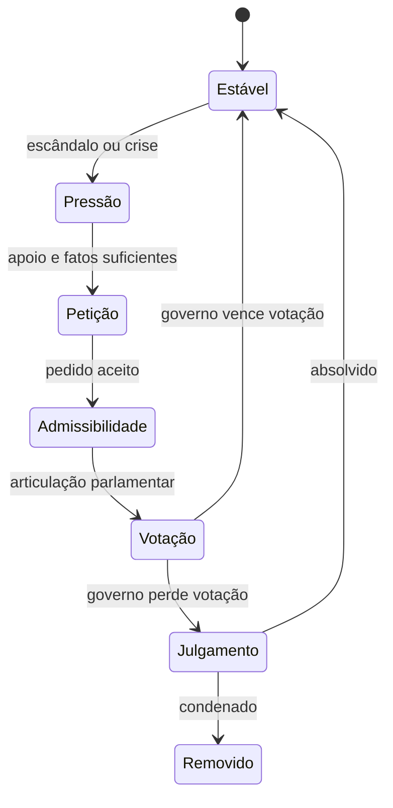

# DECRETUM — Modern Politics & UI Playbook

## Da tela funcional a uma experiência política imersiva

**Versão:** 1.0  
**Objetivo:** orientar a evolução do game design, a criação do protótipo no Claude Design e a implementação no Claude Code  
**Projeto:** DECRETUM: Salus Populi Suprema Lex

---

## 1. Decisão recomendada

Para DECRETUM, use este fluxo:

1. **Claude Design** para explorar identidade visual, criar todas as telas e validar o fluxo interativo.
2. **Claude Code + Frontend Design plugin** para transformar o conceito em componentes reais dentro do repositório existente.
3. **Claude Code + Playwright plugin** para abrir a aplicação, interagir, capturar screenshots e corrigir diferenças visuais.
4. **Figma plugin** apenas se você decidir manter um arquivo Figma como fonte de verdade ou quiser ajustar frames manualmente.

Não começaria pelo v0 ou pelo Figma Make neste projeto. Eles são boas alternativas, mas criariam mais uma etapa de tradução entre o protótipo e um código que já existe. O Claude Design tem uma vantagem direta: pode receber as telas atuais e o GDD, criar um protótipo e gerar um handoff específico para o Claude Code.

### Stack de criação

| Etapa | Ferramenta principal | Entrega |
|---|---|---|
| Direção artística | Claude Design | três conceitos comparáveis |
| Fluxo e mockups | Claude Design | protótipo desktop/mobile |
| Handoff | Claude Design | pacote com intenção, telas e assets |
| Implementação | Claude Code + Frontend Design | React/CSS integrados ao jogo |
| QA visual | Claude Code + Playwright | screenshots, testes e correções |
| Refinamento manual opcional | Figma | frames e tokens finais |

---

## 2. Diagnóstico das telas atuais

O MVP atual está funcional, mas a interface comunica uma aplicação administrativa.

### O que já funciona

- os quatro pilares estão claros;
- o mês e o ano são visíveis;
- as escolhas são inequívocas;
- o histórico confirma o resultado anterior;
- o estado do swipe já existe;
- a paleta azul-marinho e laranja oferece um ponto de partida coerente.

### O que reduz a imersão

- quatro caixas iguais no topo parecem cards de dashboard;
- a carta é um grande formulário textual, sem presença humana;
- o personagem é representado apenas por iniciais;
- a crônica aberta compete com o dilema atual;
- escolhas aparecem dentro e fora da carta, causando duplicação visual;
- o fundo é vazio e não comunica país, poder ou momento histórico;
- durante o swipe, a carta larga e sem retrato parece um painel sendo inclinado;
- a interface ocupa apenas parte da largura em alguns estados;
- não existe sinal visual de mandato, crise, coalizão ou risco constitucional;
- não há uma cerimônia clara ao entrar no poder, sobreviver a uma votação ou cair.

### Objetivo da reformulação

O jogador deve sentir que está **sozinho no centro de uma máquina política viva**. A carta é a conversa do mês; o ambiente ao redor é o país reagindo.

---

## 3. Evolução para política moderna

### 3.1 Real, mas não preso às notícias

Use países e instituições reais, mas presidentes, ministros, parlamentares, empresários e jornalistas fictícios.

Isso entrega reconhecimento e imersão sem:

- envelhecer o conteúdo a cada eleição;
- transformar o jogo em propaganda de uma figura real;
- exigir atualização diária;
- reproduzir acusações sobre pessoas existentes;
- limitar a liberdade narrativa.

O jogo deve ser **contemporâneo**, e não um simulador das manchetes da semana.

### 3.2 Um país não pode ser apenas uma bandeira

Cada país precisa alterar pelo menos:

- título do chefe de governo;
- duração e estrutura do mandato;
- nome e força do Legislativo;
- corte constitucional ou suprema corte;
- forma de remoção do governo;
- federalismo ou centralização;
- atores recorrentes;
- crises nacionais;
- calendário político;
- vocabulário da interface;
- ambiente visual e sonoro;
- ao menos 15–25 cartas exclusivas.

Cartas globais podem ser compartilhadas, desde que localizadas. Inflação, crise energética, guerra comercial e desinformação existem em vários países, mas os atores e procedimentos variam.

### 3.3 Estratégia de lançamento

Não tente produzir conteúdo profundo para todos os países do mundo na primeira versão.

#### Fase A — vertical slice

- Brasil completamente jogável;
- seletor de países já pronto;
- outros países aparecem como “Em desenvolvimento”;
- arquitetura de `country packs` implementada.

#### Fase B — contraste sistêmico

- Brasil;
- Estados Unidos;
- França;
- Reino Unido.

Esses quatro países forçam o motor a suportar presidencialismo, parlamentarismo e semipresidencialismo.

#### Fase C — expansão

- Argentina;
- Alemanha;
- México;
- Índia;
- Japão;
- África do Sul;
- outros packs selecionados por qualidade de conteúdo.

Uma tela com 195 bandeiras e o mesmo conteúdo para todas cria amplitude falsa. O diferencial de DECRETUM deve ser a sensação de que aquele sistema político realmente reage de forma própria.

---

## 4. Modelo de Country Pack

O motor deve tratar país como configuração e conteúdo, não como condicionais espalhadas.

```json
{
  "code": "BR",
  "name": "Brasil",
  "locale": "pt-BR",
  "currency": "BRL",
  "flagAsset": "flags/br.svg",
  "office": {
    "role": "president",
    "displayTitle": "Presidente da República",
    "termMonths": 48,
    "headquarters": "Palácio do Planalto"
  },
  "institutions": {
    "legislature": "Congresso Nacional",
    "lowerHouse": "Câmara dos Deputados",
    "upperHouse": "Senado Federal",
    "constitutionalCourt": "Supremo Tribunal Federal"
  },
  "removalProcess": {
    "type": "impeachment",
    "stages": [
      "pressure",
      "petition",
      "admissibility",
      "lower_house_vote",
      "trial",
      "removed"
    ]
  },
  "visualTheme": {
    "architectureKey": "brasilia_modernism",
    "primary": "#10233F",
    "accent": "#D3A33C",
    "danger": "#A13A32"
  },
  "contentPack": "br-v1"
}
```

### 4.1 Pilares universais

Internamente, use nomes neutros:

- `public_power`;
- `economic_power`;
- `legislative_power`;
- `institutional_power`.

A interface localiza os nomes:

| Conceito | Brasil | Estados Unidos | Reino Unido |
|---|---|---|---|
| `public_power` | Povo | Public | Public |
| `economic_power` | Mercado | Economy | Economy |
| `legislative_power` | Congresso | Congress | Parliament |
| `institutional_power` | Instituições | Federal Institutions | State Institutions |

O significado original permanece: os medidores representam poder e dependência. Zero significa colapso daquela relação; cem significa domínio sobre o governo.

---

## 5. Impeachment e remoção do poder

Impeachment não deve ser um game over aleatório nem apenas “Congresso chegou a zero”. Ele deve ser uma **cadeia política visível e interrompível**.

### 5.1 Estado do processo



Os nomes e as etapas exatas são definidos pelo país.

### 5.2 Variáveis do processo

Não adicione um quinto medidor permanente ao topo. Use um objeto de crise ativado somente quando necessário:

```json
{
  "type": "impeachment",
  "stage": "petition",
  "severity": 62,
  "publicVisibility": "high",
  "evidence": 48,
  "legislativeMomentum": 57,
  "institutionalSupport": 41,
  "nextReviewTurn": 19
}
```

Os valores podem existir no domínio, mas a UI mostra linguagem política:

- “rumores no Congresso”;
- “pedido protocolado”;
- “apoio insuficiente para avançar”;
- “votação iminente”;
- “julgamento aberto”.

Uma opção de acessibilidade/estratégia pode exibir números exatos.

### 5.3 Fontes de risco

- flags de corrupção ou abuso de poder;
- ignorar órgãos de controle;
- crises econômicas prolongadas;
- apoio popular crítico;
- coalizão rompida;
- vazamentos;
- descumprimento de decisões judiciais;
- uso excepcional de forças de segurança;
- decisões específicas do país.

### 5.4 Formas de reagir

- entregar um ministro;
- liberar investigação;
- negociar agenda;
- formar nova coalizão;
- fazer pronunciamento;
- recorrer à corte;
- convocar apoio popular;
- aceitar uma comissão independente;
- renunciar, em cartas raras;
- enfrentar a votação.

Nenhuma saída é grátis. Salvar o mandato deve deslocar poder entre os quatro pilares e criar legados.

### 5.5 Exemplo de cadeia brasileira

1. **Notas frias no Ministério** — investigar ou abafar.
2. **O pedido chega à Câmara** — negociar, entregar aliados ou contestar.
3. **O Presidente da Câmara decide** — evento de admissibilidade.
4. **A votação televisionada** — cartas de articulação antes do resultado.
5. **O Senado abre julgamento** — afastamento e decisão final.
6. **Absolvição, renúncia ou remoção** — ending e sucessão.

O jogo deve pesquisar e documentar o procedimento de cada país em fontes oficiais antes de publicar aquele pack. As regras processuais não devem ser inventadas apenas por conveniência.

---

## 6. Nova direção visual

### 6.1 Nome da direção

**The Living Republic — o gabinete à meia-noite**

Uma experiência política editorial e cinematográfica, construída com:

- arquitetura modernista;
- documentos presidenciais;
- retratos vetoriais geométricos;
- selos, carimbos e fitas de votação;
- fundos atmosféricos que reagem ao país e à crise;
- uma carta central tátil, com forte presença humana.

### 6.2 Relação com Reigns

Preservar apenas princípios genéricos:

- um dilema por vez;
- carta central;
- escolha horizontal;
- quatro forças resumidas no topo;
- interface silenciosa ao redor do conflito.

Não copiar:

- logo;
- proporção exata das áreas;
- ícones;
- tipografia;
- paleta;
- personagens;
- moldura de carta;
- composição específica;
- fundo montanhoso;
- feedback ou textos.

### 6.3 Elemento memorável

O principal elemento deve ser o **retrato político vivo dentro de um dossiê presidencial**. Todo o resto é contido.

A ilustração ocupa 55–65% da carta. Durante o arraste:

- o personagem acompanha discretamente a direção;
- um selo de decisão surge no lado escolhido;
- as tendências dos pilares aparecem próximas ao selo;
- o fundo reage levemente, sem animações constantes.

### 6.4 Layout desktop

- composição central, largura útil aproximada de 420–560 px;
- fundo full-screen inspirado no edifício de governo do país;
- cabeçalho fino: bandeira, país, cargo e data;
- quatro pilares como símbolos/medidores compactos, não cards independentes;
- carta vertical de dossiê no centro;
- escolhas aparecem com o gesto, não como dois grandes botões permanentes concorrentes;
- botões acessíveis discretos abaixo da carta;
- crônica abre em drawer lateral;
- mandato aparece como linha temporal na base;
- risco constitucional aparece como selo lateral somente quando ativo.

### 6.5 Layout mobile

- carta ocupa aproximadamente 70% da largura e 58–65% da altura útil;
- quatro símbolos cabem em uma única linha;
- texto nunca é cortado;
- botões de fallback ficam dentro da zona do polegar;
- crônica abre como bottom sheet;
- mudança de orientação não perde estado;
- gesto não interfere no scroll de overlays.

### 6.6 Medidores

Substituir os quatro mini-cards por quatro emblemas com preenchimento vertical ou radial.

Estados:

- normal: contorno marfim;
- baixo: preenchimento recua e rachadura inferior;
- alto: preenchimento pressiona o contorno;
- crítico: pulso único ao mudar, mais rótulo textual;
- colapso: símbolo se rompe ou domina a tela conforme o ending.

Não depender de cor. Usar forma, texto e movimento.

### 6.7 A carta

Estrutura sugerida:

1. pequeno identificador do gabinete;
2. nome e cargo do interlocutor;
3. retrato vetorial;
4. dilema em 2–4 linhas;
5. área de selo esquerdo/direito durante o arraste;
6. consequência curta após confirmar.

O texto e o retrato podem trocar de posição entre desktop e mobile, mas a hierarquia deve ser consistente.

### 6.8 Crônica

Remover a caixa permanente da tela principal. Transformar a crônica em:

- drawer no desktop;
- bottom sheet no mobile;
- timeline por mês;
- cada decisão como um recorte de jornal/nota oficial;
- filtros por crise, país e pilar;
- botão discreto com badge quando uma consequência nova entra.

### 6.9 Impeachment na interface

Quando o processo nasce:

- um envelope vermelho lacrado entra na mesa;
- o som/feedback muda;
- um selo lateral mostra a etapa atual;
- a carta relacionada usa papel mais frio e borda processual;
- a votação usa uma tela própria, com assentos ou marcas preenchendo o quórum;
- sobreviver deve ter impacto visual tão forte quanto perder.

Evitar barra genérica chamada “Impeachment 63%”. Mostrar primeiro o processo; números podem aparecer em detalhes.

---

## 7. Telas que o Claude Design deve produzir

1. Tela de abertura.
2. Seleção de país.
3. Dossiê do país e escolha de dificuldade/contexto.
4. Posse/tutorial.
5. Gameplay normal — desktop.
6. Gameplay normal — mobile.
7. Swipe para a esquerda.
8. Swipe para a direita.
9. Consequência da decisão.
10. Pilares em estado crítico.
11. Crônica aberta.
12. Pedido de impeachment protocolado.
13. Votação de admissibilidade.
14. Julgamento/remoção.
15. Absolvição e retorno ao governo.
16. Mandato concluído.
17. Ending comum.
18. Seleção de sucessor.
19. Pausa, configurações e acessibilidade.
20. Estado de erro/reconexão.

---

## 8. Como usar o Claude Design

### Passo 1 — criar o projeto

Abra o Claude Design e crie um projeto chamado:

`DECRETUM — The Living Republic`

Anexe:

- o GDD principal;
- este playbook;
- screenshots atuais;
- screenshots de referência;
- logo provisório, se existir.

Identifique claramente quais imagens são **referência** e quais mostram a **implementação atual**.

### Passo 2 — explorar antes de fechar

Use o Prompt 1. Não peça todas as telas imediatamente. Primeiro escolha uma direção.

### Passo 3 — construir o protótipo

Depois de escolher a direção, use os Prompts 2–5 em sequência. Faça comentários diretamente nos elementos quando o problema for local.

### Passo 4 — validar

Teste:

- leitura em poucos segundos;
- swipe com mouse e toque;
- clareza das escolhas;
- risco alto/baixo dos pilares;
- fluxo completo de impeachment;
- mobile 360×800;
- desktop 1440×900;
- reduced motion;
- contraste e foco de teclado.

### Passo 5 — handoff

Quando o design estiver aprovado, use a ação de **Handoff to Claude Code** do Claude Design. Inclua no pacote:

- todas as telas aprovadas;
- tokens;
- assets;
- estados interativos;
- regras responsivas;
- comentários de intenção;
- o que é visual e o que depende do motor real.

---

## 9. Prompts para Claude Design

### Prompt 1 — três direções artísticas

```text
You are the lead product designer and game UI art director for DECRETUM: Salus Populi Suprema Lex, a modern political decision game for web and mobile.

Read the attached GDD and Modern Politics & UI Playbook completely before designing.

The attached Reigns screenshots are references only for these abstract qualities:
- one dominant decision at a time;
- a centered, theatrical card;
- horizontal choice interaction;
- four forces readable at a glance;
- strong atmosphere with little interface clutter.

Do not copy Reigns' logo, icons, card proportions, typography, colors, characters, background composition, or exact layout.

The attached DECRETUM screenshots show the current functional build. Preserve its game information, but redesign its visual hierarchy. The current version looks like an admin dashboard: too many rectangular panels, no character presence, duplicated choices, persistent chronicle content, and large dead areas.

Create three clearly different art-direction boards for DECRETUM. Each direction must include:
1. a desktop gameplay key screen;
2. a mobile gameplay key screen;
3. a country-selection key screen;
4. an impeachment alert key screen;
5. a 6-color token palette with hex values;
6. typography choices and roles;
7. portrait/illustration style;
8. motion concept;
9. explanation of what makes the direction specific to modern political power rather than generic fantasy or SaaS UI.

All interface copy must be Brazilian Portuguese.

Explore these territories without combining them into one generic compromise:
A. The Living Republic — cinematic presidential office at midnight, modernist architecture, geometric portrait dossier, restrained brass and constitutional red.
B. Public Record — broadcast graphics, government archives, live vote tallies, newsprint evidence, colder and more procedural.
C. Civic Modernism — bold national geometry, mid-century institutional posters, tactile paper and screen-print portraiture.

Use real countries and institutions, but use fictional politicians and fictional current events. Do not display a real living politician.

Spend visual boldness on the character dossier card. Keep the rest disciplined. Avoid generic AI design: no purple gradients, glassmorphism, identical SaaS cards, excessive rounded rectangles, decorative charts, or random glow.

Do not write production code yet. Present the three directions side by side for selection and critique.
```

### Prompt 2 — fechar a direção escolhida

Substitua `[DIRECTION]` pela direção escolhida.

```text
Proceed with direction [DIRECTION].

Create the final DECRETUM design system and a high-fidelity interactive prototype. The experience should feel like occupying a presidential office during a national crisis: quiet, ceremonial, readable, and tense.

Design tokens:
- 6–8 semantic colors with light/dark text pairings;
- type scale;
- spacing scale;
- border, paper, shadow, and surface rules;
- motion durations and easing;
- four original pillar symbols;
- critical, disabled, loading, focus, and reduced-motion states.

Gameplay composition:
- full-screen country-reactive background;
- compact header with flag, country, office, month, and year;
- four compact power emblems, never four dashboard cards;
- centered vertical political dossier card;
- fictional speaker portrait occupying most of the card;
- dilemma readable in 2–4 lines;
- left/right decision seals revealed during drag;
- trend indicators on the currently previewed decision;
- accessible fallback buttons that do not compete visually with the card;
- mandate timeline near the bottom;
- chronicle hidden behind a drawer or bottom sheet.

The final system must work for multiple countries without becoming visually generic. Country identity should change architectural background, flag, official terminology, subtle accent, and institutional seals while preserving the same component system.

Produce desktop 1440×900 and mobile 390×844 versions. Use realistic Brazilian Portuguese copy from the GDD, not lorem ipsum.
```

### Prompt 3 — seleção de país

```text
Design and prototype DECRETUM's country-selection flow.

The player is choosing a political system, not merely a flag. Each country card must communicate:
- country name and flag;
- head-of-government role;
- term length;
- political system;
- legislature name;
- removal mechanism;
- difficulty profile;
- one sentence describing the country's central governing tension.

Create featured cards for:
- Brasil — Presidential federal republic; coalition management and impeachment;
- United States — Presidential federal republic; divided government and congressional investigations;
- France — Semi-presidential republic; cohabitation and street mobilization;
- United Kingdom — Parliamentary monarchy; confidence votes and party leadership.

For the current vertical slice, Brasil is playable and the others can show “Em desenvolvimento”, but design the component so enabling them later requires no redesign.

After selecting Brasil, show a short presidential briefing rather than a settings form. Include:
- Palácio do Planalto-inspired original geometric environment;
- Presidente da República;
- 48-month mandate;
- Congresso Nacional and Supremo Tribunal Federal;
- the four power centers;
- a single action: “Tomar posse”.

Do not use a grid of generic SaaS pricing cards. Make the selection feel like opening classified constitutional dossiers.
```

### Prompt 4 — impeachment

```text
Create a complete interactive impeachment flow for the Brazilian country pack in DECRETUM.

The process must feel procedural and political, not like a generic health bar or random game-over popup.

Design these states:
1. rumors and mounting pressure;
2. a petition arriving as a sealed red dossier;
3. admissibility accepted;
4. congressional negotiation cards before the vote;
5. a televised lower-house vote visualization;
6. trial phase;
7. acquittal and return to office;
8. removal and succession.

Show the current stage using plain language. Keep exact percentages secondary, available in details. Use chamber seats, vote slips, seals, signatures, or procedural documents as information graphics. Do not use a generic red progress bar labeled “Impeachment”.

The main gameplay must remain recognizable during the crisis, but the environment should tighten: colder light, more press silhouettes, urgent documents, restrained constitutional red.

Use fictional ministers and allegations. Do not depict or name real politicians. Add accessible text alternatives for every visual vote state.
```

### Prompt 5 — interaction and responsive QA

```text
Refine the approved DECRETUM prototype as an interaction and accessibility specialist.

Verify and demonstrate:
- swipe left and right with mouse, touch, and pointer events;
- the card returns to center below the commit threshold;
- the choice is confirmed only after crossing a clear threshold;
- decision labels and pillar trends appear during preview;
- buttons provide an equivalent non-gesture interaction;
- keyboard focus is visible;
- the flow works without hover;
- no information depends only on color;
- text remains legible at 200% zoom;
- prefers-reduced-motion has a coherent alternative;
- mobile works at 360×800 and 390×844;
- desktop works at 1280×720 and 1440×900;
- network loading prevents duplicate decisions without freezing the interface;
- an error restores the unresolved card and explains how to retry.

Create an interaction specification table with trigger, animation, duration, easing, state change, audio cue, reduced-motion behavior, and failure behavior.

Then perform a visual critique. Remove any element that does not communicate country, character, decision, consequence, time, power, or constitutional danger.
```

### Prompt 6 — handoff

```text
Prepare this approved DECRETUM prototype for Claude Code handoff.

The production repository already exists and uses Next.js App Router, React, JavaScript, CSS, PostgreSQL, and a server-authoritative game engine.

Constraints:
- JavaScript only; do not convert the repository to TypeScript;
- do not introduce Tailwind, shadcn, Material UI, Chakra, or another UI framework;
- preserve existing domain, API, persistence, tests, and route behavior;
- represent design tokens with CSS custom properties;
- use CSS Modules or the repository's existing CSS organization;
- assets must have clear licenses or be newly created;
- all new interactions require keyboard and reduced-motion behavior;
- the server remains authoritative for choices and effects.

Include in the handoff:
- approved desktop and mobile screens;
- design tokens;
- component inventory;
- responsive rules;
- interaction states;
- empty, loading, conflict, reconnect, and game-over states;
- asset exports;
- annotations distinguishing visual prototypes from real domain behavior;
- a prioritized implementation sequence.

Do not generate a separate replacement application. This handoff will be integrated into an existing codebase.
```

---

## 10. Preparar o Claude Code

Dentro de uma sessão interativa do Claude Code:

```text
/plugin install frontend-design@claude-plugins-official
/plugin install playwright@claude-plugins-official
```

Se o marketplace oficial não estiver registrado:

```text
/plugin marketplace add anthropics/claude-plugins-official
```

Depois:

```text
/reload-plugins
```

Opcional, se você usar Figma:

```text
/plugin install figma@claude-plugins-official
```

Instale no escopo **project** apenas plugins que todos os colaboradores devem usar. Caso seja uma preferência sua, escolha **local** ou **user**.

---

## 11. Como passar o design ao Claude Code

1. Abra o repositório correto no Claude Code.
2. Confirme que `AGENTS.md`, `CLAUDE.md` e o GDD estão presentes.
3. Use o handoff gerado pelo Claude Design.
4. Não peça “implemente tudo” na primeira mensagem.
5. Faça Claude mapear o código e produzir uma matriz `tela → componente → estado → endpoint`.
6. Implemente em fatias, capturando screenshots após cada uma.
7. Faça uma etapa separada para o sistema político; não esconda regras novas dentro de componentes.

### Ordem segura

1. tokens e fontes;
2. shell/background/header;
3. pilares;
4. carta e retrato;
5. swipe e feedback;
6. crônica responsiva;
7. seletor de país;
8. country-pack no domínio;
9. impeachment state machine;
10. telas de votação e ending;
11. QA visual e acessível.

---

## 12. Prompts para Claude Code

### Prompt A — análise sem alteração

```text
Read these sources completely before acting:
1. AGENTS.md
2. CLAUDE.md
3. the DECRETUM GDD
4. Decretum_UI_Modern_Politics_Playbook_v1.0.md
5. the Claude Design handoff bundle

Use the frontend-design skill for visual analysis.

Do not edit files yet.

Inspect the existing Next.js application and return:
- the current UI component tree;
- where game state is loaded and mutated;
- current CSS organization;
- current swipe implementation;
- tests that protect existing behavior;
- a screen-to-component-to-domain-state matrix for the approved design;
- differences between the design prototype and real backend behavior;
- a phased implementation plan with small reversible commits.

Constraints:
- JavaScript only;
- preserve current APIs and game rules unless the GDD addendum explicitly changes them;
- no Tailwind or component framework;
- do not build a parallel application;
- do not put country or impeachment rules inside React components.

Finish by naming the first vertical slice you recommend implementing. Wait for approval before editing.
```

### Prompt B — fundação visual

```text
Implement only Phase 1: DECRETUM's visual foundation from the approved Claude Design handoff.

Scope:
- CSS custom-property design tokens;
- typography loading with performant fallbacks;
- responsive full-screen game shell;
- country-reactive background abstraction with Brasil as the first theme;
- compact header with country, office, and date;
- four accessible power emblems replacing dashboard cards;
- layout primitives needed by later phases.

Do not change game logic, API behavior, database schema, card selection, or decision processing.
Do not implement the new card or impeachment UI yet.
Do not add Tailwind, shadcn, TypeScript, or a broad UI library.

Preserve an accessible textual value for each pillar. Respect reduced motion and 200% zoom.

After implementation:
1. run existing tests, lint, and build;
2. start the app;
3. use Playwright to capture desktop 1440×900 and mobile 390×844 screenshots;
4. compare them against the handoff;
5. fix visible overflow, hierarchy, and contrast problems;
6. report changed files and remaining differences.
```

### Prompt C — carta e swipe

```text
Implement Phase 2: the political dossier card and decision interaction.

Use the approved Claude Design states as visual targets, while preserving the existing server-authoritative decision flow.

Requirements:
- fictional speaker portrait area with asset fallback;
- speaker name and localized title;
- dilemma text;
- left/right seals revealed during pointer drag;
- pillar trend preview for the active choice;
- commit threshold and spring-back below threshold;
- equivalent accessible buttons;
- keyboard interaction;
- loading lock that prevents duplicate submissions;
- conflict and network-error recovery;
- exact effects shown only after server response;
- consequence as a temporary, readable transition;
- no permanent duplicate choice buttons competing with the card;
- crônica removed from the main flow and opened as a drawer/bottom sheet.

Do not calculate effects on the client.
Do not make probabilistic UI tests.

Add focused component and interaction tests. Run test, lint, build, then use Playwright to test mouse drag, touch-equivalent pointer drag, keyboard, failure recovery, mobile, desktop, and reduced motion. Capture screenshots of centered, left-preview, right-preview, resolving, and resolved states.
```

### Prompt D — country packs

```text
Implement Phase 3: data-driven country selection and the Brasil country pack foundation.

First inspect the domain and database boundaries. If a schema change is required, create a migration. Do not encode country-specific behavior as scattered if statements.

Scope:
- country profile model and validator;
- game.country_code;
- Brasil profile with localized office and institution names;
- country-selection screen;
- presidential briefing and “Tomar posse” flow;
- country context returned by create/get game endpoints;
- visual theme selected through semantic data attributes or CSS variables;
- existing games receive a documented safe default;
- other country cards may appear disabled as “Em desenvolvimento”.

Do not add shallow playable versions of other countries.
Do not use real politicians.
Do not replace existing cards yet unless required for localization.

Write migrations, unit tests, integration tests, and UI tests. Run migrations in development and test environments, then run the full validation suite and capture the selection and briefing screens on mobile and desktop.
```

### Prompt E — impeachment engine

```text
Implement Phase 4: the generic removal-process state machine and the first Brazilian impeachment chain.

This is domain work first and UI work second. Use the game-engine and database specialists when useful. Keep the main session responsible for integration.

Domain requirements:
- removal process configured by country;
- explicit states: stable, pressure, petition, admissibility, lower_house_vote, trial, removed/acquitted;
- deterministic transitions driven by flags, decisions, scheduled events, and game state;
- no random instant removal;
- process persisted independently of React;
- all transitions recorded in the chronicle;
- concurrent decisions cannot advance the process twice;
- existing extreme-pillar endings continue to work;
- removal produces a configurable ending and enables a successor.

Brazil content:
- fictional scandal trigger;
- petition card;
- admissibility event;
- negotiation cards;
- lower-house vote;
- trial;
- acquittal and removal outcomes.

UI requirements:
- sealed dossier introduction;
- stage badge visible only while active;
- procedural timeline in details;
- accessible vote visualization;
- distinct acquittal and removal sequences;
- no generic impeachment percentage bar.

Before encoding real procedural claims, cite the official sources used in docs/country-packs/brasil.md. If the implementation simplifies a rule, label it explicitly as a gameplay abstraction.

Use TDD for state transitions. Add integration tests for persistence, concurrency, ending, and succession. Run full tests, lint, build, and Playwright flows for both acquittal and removal.
```

### Prompt F — revisão visual final

```text
Perform a final visual and interaction review of DECRETUM using the frontend-design and Playwright capabilities.

Do not redesign from scratch.

Test these viewports:
- 360×800
- 390×844
- 768×1024
- 1280×720
- 1440×900
- 1920×1080

Capture and review:
- country selection;
- briefing;
- normal game;
- both swipe previews;
- decision consequence;
- all four low/high critical meter styles;
- chronicle;
- impeachment petition;
- vote;
- acquittal;
- removal;
- mandate completion;
- loading, conflict, offline, and reconnect states.

Evaluate:
- hierarchy;
- legibility;
- overflow;
- pointer and keyboard parity;
- contrast;
- reduced motion;
- touch targets;
- visual consistency with the Claude Design handoff;
- whether any part still resembles SaaS/admin UI;
- whether any part copies a reference game too closely.

Fix high- and medium-priority issues only. Run tests, lint, and build again. Produce a concise before/after report with screenshot paths and any low-priority remaining differences.
```

---

## 13. Componentes esperados

Os nomes podem mudar para se adequar ao repositório.

```text
GameExperience
├── CountryAtmosphere
├── GovernmentHeader
├── PowerBalance
│   └── PowerEmblem × 4
├── DecisionStage
│   ├── PoliticalDossierCard
│   ├── ChoiceSeal
│   └── DecisionFallbackControls
├── ConsequenceTransition
├── MandateTimeline
├── ConstitutionalThreatBadge
├── ChronicleDrawer
├── CountrySelector
├── InaugurationBriefing
└── RemovalProcessOverlay
    ├── ProcessTimeline
    ├── VoteChamber
    └── RemovalOutcome
```

Lógica de `CountryPack`, `RemovalProcess`, elegibilidade, decisões, flags e endings não pertence a esses componentes.

---

## 14. Assets

Para o primeiro pack, produzir:

- quatro símbolos de pilares em SVG;
- bandeira do Brasil proveniente de fonte compatível ou desenhada de forma correta;
- fundo original inspirado no modernismo cívico de Brasília, sem copiar fotografia;
- 8–12 retratos vetoriais de personagens fictícios;
- selo DECRETUM;
- selo de processo constitucional;
- texturas leves de papel e tinta;
- ícones de crônica, configurações, áudio e acessibilidade;
- marcas visuais de votação.

Mantenha retratos e fundos separados da carta para responsividade e animação. SVG é preferível para símbolos e selos; retratos podem ser SVG ou WebP/PNG de alta resolução.

---

## 15. Regras para não virar um clone

- não usar a mesma silhueta ou grid da tela de referência;
- não usar quatro ícones equivalentes aos do jogo de referência;
- não copiar a posição relativa exata de texto, retrato e indicadores;
- não replicar tipografia monoespaçada ou logo;
- não usar o mesmo fundo noturno montanhoso;
- não reutilizar personagens, eventos ou textos;
- não descrever o jogo publicamente como “Reigns de política moderna”;
- documentar a identidade: dossiê presidencial, modernismo cívico, processo constitucional e country packs.

Inspiração mecânica é útil; identidade própria é obrigatória.

---

## 16. Critério de sucesso

A reformulação está funcionando quando, sem explicação externa, um novo jogador consegue responder em cinco segundos:

1. qual país governa;
2. qual cargo ocupa;
3. em que momento do mandato está;
4. quem está falando;
5. qual decisão precisa tomar;
6. quais forças serão afetadas;
7. se existe ameaça constitucional ativa.

E quando a interface transmite, sem virar um dashboard:

> **“Este não é um menu de decisões. É a sala onde um governo pode sobreviver ou cair.”**

---

## 17. Referências oficiais das ferramentas

- Claude Design: https://www.anthropic.com/news/claude-design-anthropic-labs
- Frontend Design plugin: https://claude.com/plugins/frontend-design
- Claude Code plugins: https://code.claude.com/docs/en/discover-plugins
- Figma Make code model: https://developers.figma.com/docs/code/
- v0: https://v0.app/

